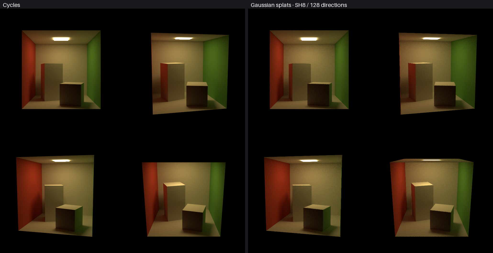
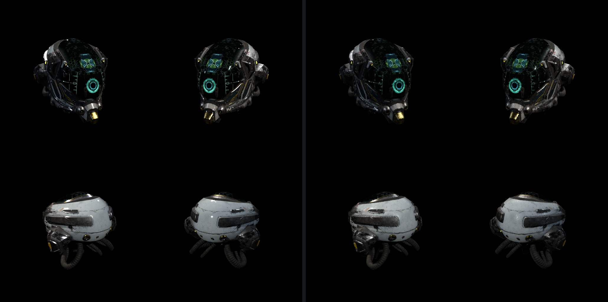
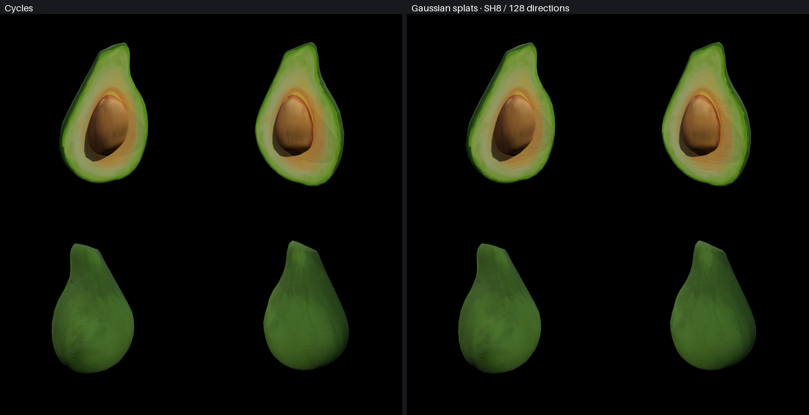
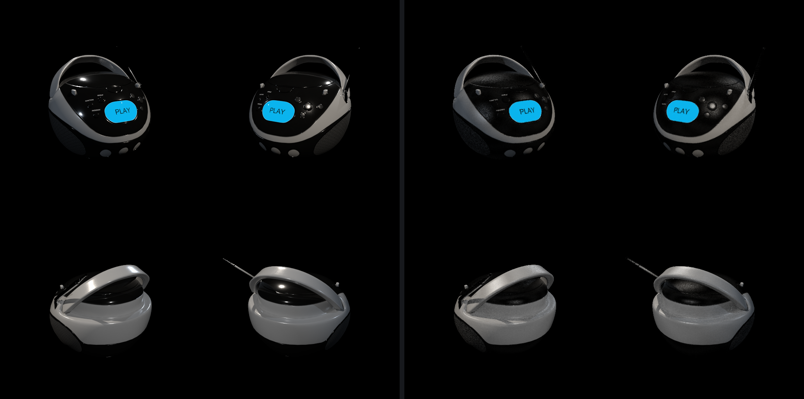
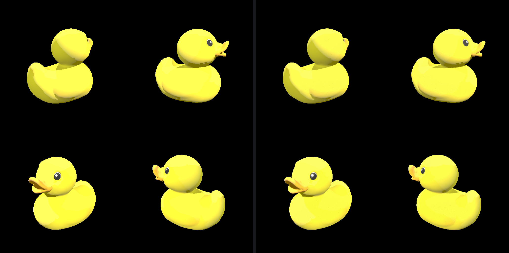
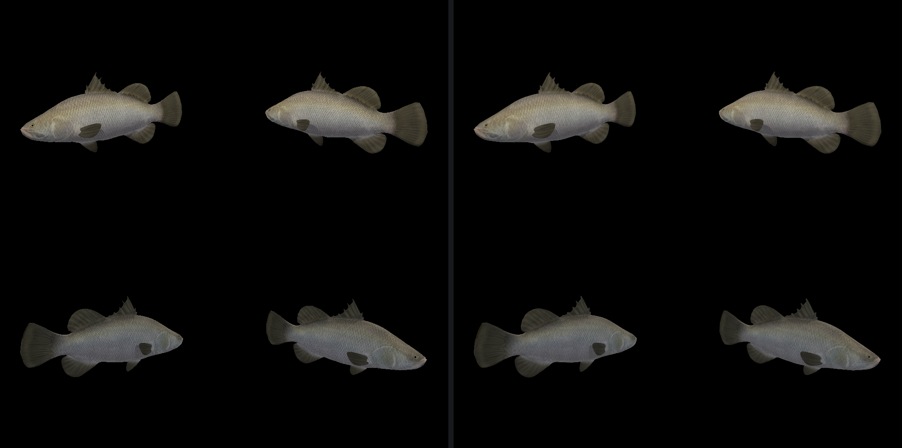

# Baking Ray Tracing into Gaussian Splats

A ray-tracer renders a scene by shooting rays from a light source, bouncing them around the scene, and accumulating color until they enter a camera lens.

Instead, we can precompute, for points across the mesh, the color of the final bounce from many different viewing angles. This information is baked into a standard 3D Gaussian Splat scene and can then be viewed from anywhere.

## Pipeline

1. Sample disk-shaped splats on the mesh surface according to triangle area.
2. For each splat and a set of viewing angles, query the radiance.
3. Fit splat opacity and view-dependent SH color coefficients.

## Usage

The below bakes and views the Cornell box using blender's cycles renderer.

```bash
uv run python -m gaussian_splats.bake bake cycles \
  --mesh assets/cornell-box/cornell_box_core.glb \
  --output output/cornell.pt \
  --n-splats 262144 --samples 32 --view-samples 16 --sh-degree 0

uv run visualize --checkpoint output/cornell.pt
```

See [viewer](../visualize/README.md) for more options.

## Examples

| Scene | Renderer | Splats | Camera Rays (M) | Bake Rays (M) | SSIM | PSNR (dB) |
| --- | --- | ---: | ---: | ---: | ---: | ---: |
| Cornell box | Cycles | 262,144 | 1073.74 | 134.22 | 0.9742 | 34.92 |
| Damaged Helmet | Cycles | 262,144 | 1073.74 | 1073.74 | 0.9576 | 31.37 |
| Avocado | Cycles | 131,324 | 1073.74 | 268.95 | 0.9894 | 41.40 |
| Boom Box | Cycles | 262,144 | 1073.74 | 536.87 | 0.9608 | 31.79 |
| Duck | Phong | 131,072 | 0.26 | 0.13 | 0.9852 | 31.44 |
| Barramundi Fish | Phong | 131,072 | 0.26 | 0.13 | 0.9636 | 36.87 |

---

The left 2x2 grid is the reference rendered image. The right is the scene baked into splats and then rendered.

### Cornell box · Cycles



Cycles at 4096 samples per pixel with exposure 4.
Splats baked with SH degree 0, 16 directions per splat, 32 samples per direction, 10% SH smoothing.

### Damaged Helmet · Cycles



Cycles at 4096 samples per pixel with exposure 0.
Splats baked with SH degree 10, 128 directions per splat, 32 samples per direction.

### Avocado · Cycles



Cycles at 4096 samples per pixel with exposure 0.
Splats baked on a projected grid with SH degree 2, 16 directions per splat, 128 samples per direction.

### Boom Box · Cycles



Cycles at 4096 samples per pixel with exposure 0.
Splats baked with SH degree 8, 128 directions per splat, 16 samples per direction.

### Duck · Phong



Phong at 1 sample per pixel.
Splats baked with SH degree 0, 1 direction per splat, 1 sample per direction.

### Barramundi Fish · Phong



Phong at 1 sample per pixel.
Splats baked with SH degree 0, 1 direction per splat, 1 sample per direction.

## Room for Improvement

- Sharp specular highlights do not transfer well (see Damaged Helmet and Boom Box). They tend to diffuse out through the texture. Possible solutions: material aware sampling (sample more views directions from highly specular surfaces); better SH fitting (We regularize heavily (both by damping high frequencies and by solving in sRGB space)); maybe spherical voronois?
- Soft splats struggle with straight edges, silhouettes and fine detail (see Cornell's box edges and Fish's scales and fins). Possible solutions: curvature aware splat sampling (change density, or footprint size)
- Faster baking. We perform theoretically less sample queries than cycles but don't see the gains (e.g. 34.7s bake vs 3.3s render for the damaged helmet and 4.4s bake vs 8.4s render the cornell box).


## Credits

Inspiration and thanks to [Mesh2Splat](https://github.com/electronicarts/mesh2splat).

### Asset credits

| Asset | Credits and license |
|---|---|
| [Damaged Helmet](https://github.com/KhronosGroup/glTF-Sample-Assets/tree/main/Models/DamagedHelmet) | ctxwing (2018), CC BY 4.0; earlier model by theblueturtle_ (2016), CC BY-NC 4.0 |
| [Avocado](https://github.com/KhronosGroup/glTF-Sample-Assets/tree/main/Models/Avocado) | Microsoft (2017), CC0 1.0 |
| [Boom Box](https://github.com/KhronosGroup/glTF-Sample-Assets/tree/main/Models/BoomBox) | Microsoft (2017), CC0 1.0 |
| [Duck](https://github.com/KhronosGroup/glTF-Sample-Assets/tree/main/Models/Duck) | Sony (2006), SCEA Shared Source License 1.0 |
| [Barramundi Fish](https://github.com/KhronosGroup/glTF-Sample-Assets/tree/main/Models/BarramundiFish) | Microsoft (2017), CC0 1.0 |
