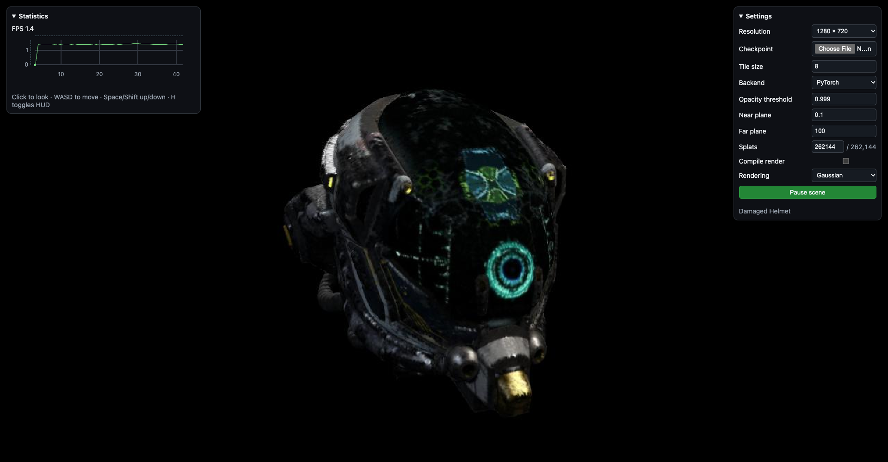
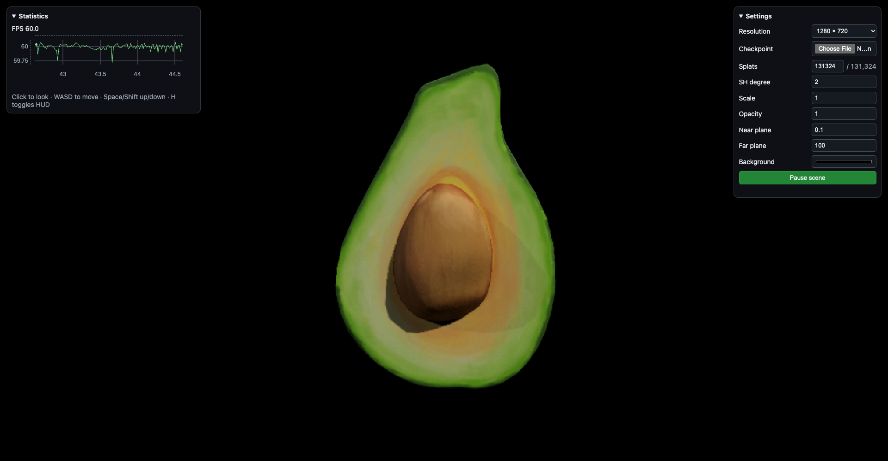
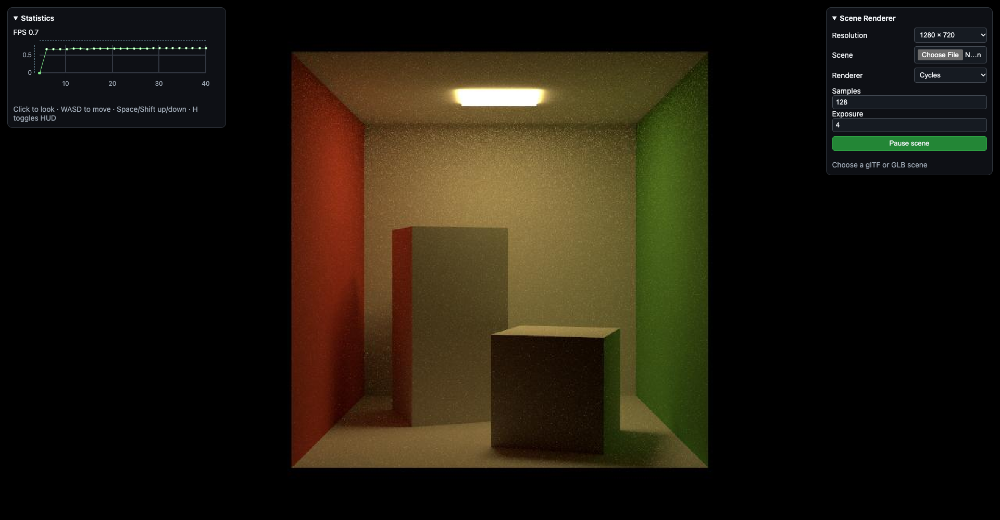
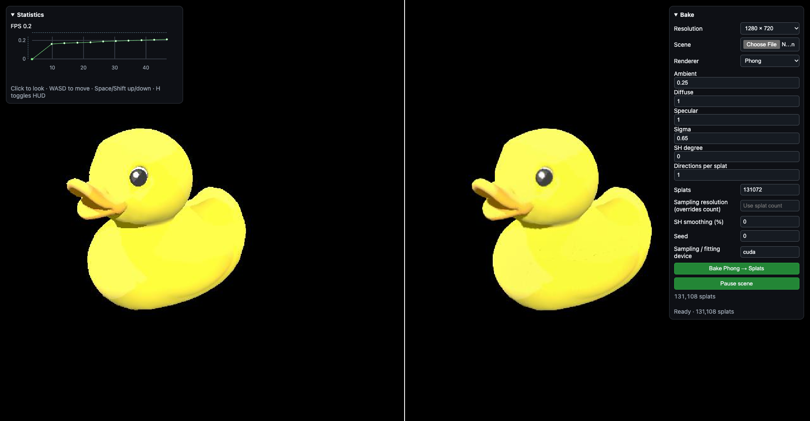

# Viewer

```bash
uv run visualize
```

Open <http://127.0.0.1:7007/> and choose a page. To preload a splat checkpoint:

```bash
uv run visualize --checkpoint output/cornell.pt
```

In all scenes, click into it, use **WASD** to move, **Space / Shift** to move up / down, and **Esc** to release the mouse.

## Gaussian splats · `/gaussian/`

Load a `.pt` checkpoint and render it with PyTorch, Triton or gsplat. Triton and gsplat require a CUDA GPU.



## PlayCanvas · `/viewer/`

Load a `.pt` checkpoint and render locally in a WebGPU-capable browser.



## Scene renderer · `/scene/`

Load a `.glb` or `.gltf` scene and render using Cycles, Eevee, Blender Workbench, Torch Workbench or Phong. Requires Blender on your `PATH`; a self-contained `.glb` is simplest to upload.



## Bake comparison · `/bake/`

Load a mesh, select a renderer, adjust sampling, SH and query settings, then click **Bake**. The mesh render appears on the left and the baked splats on the right, sharing the same camera. Requires Blender on your `PATH`.


